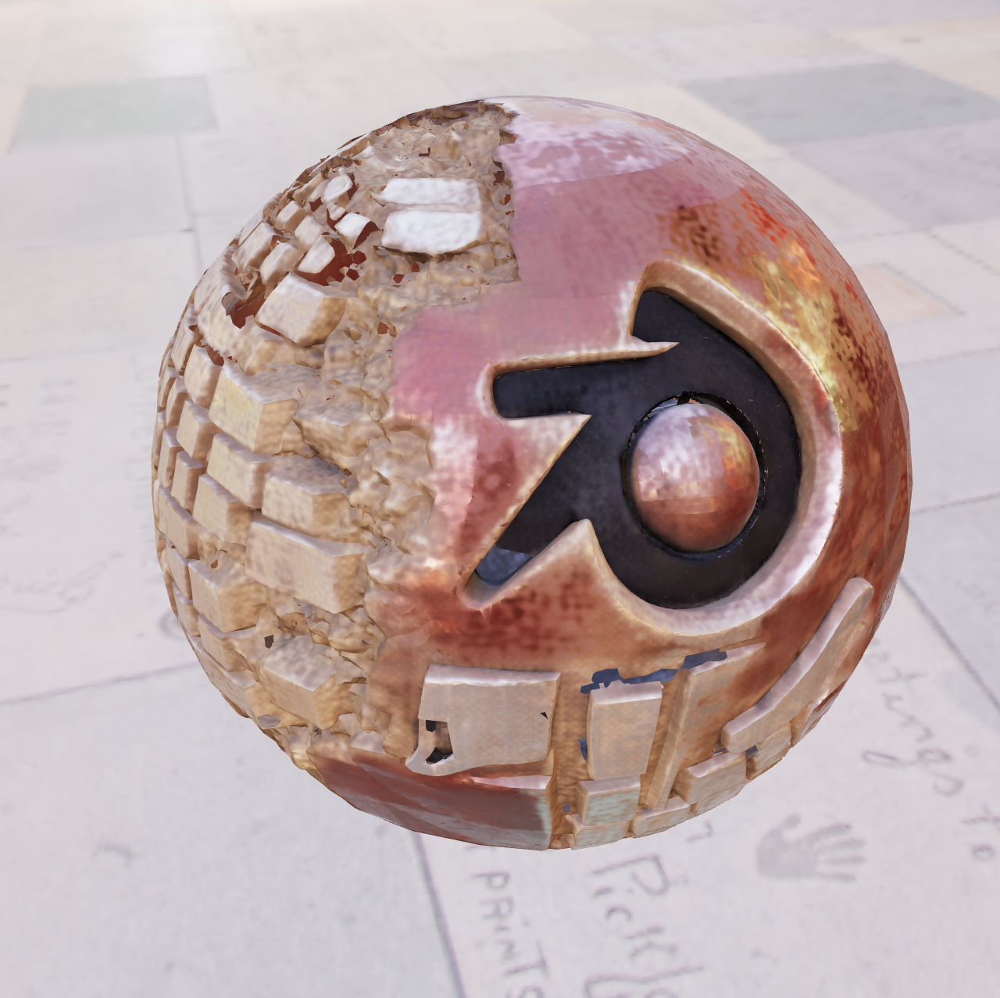
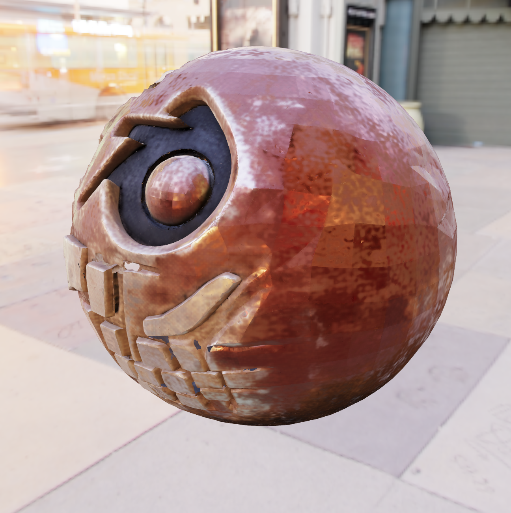
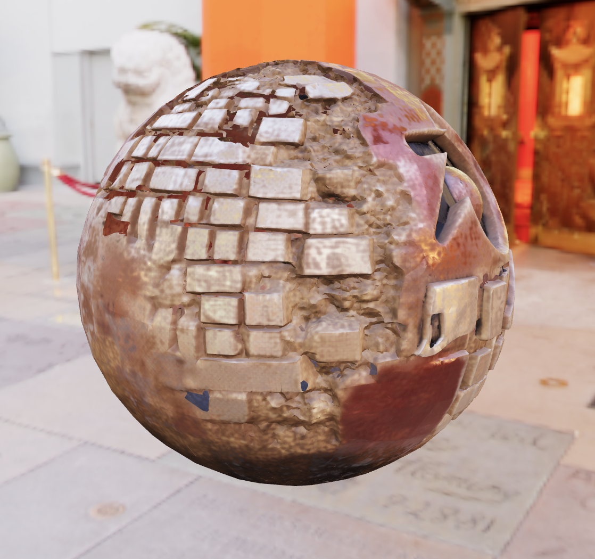

# trellis2mlx

MLX-native [TRELLIS.2](https://github.com/microsoft/TRELLIS.2) inference for Apple Silicon.

Run [TRELLIS.2](https://github.com/microsoft/TRELLIS.2) 3D generation on Mac using [MLX](https://github.com/ml-explore/mlx). No NVIDIA GPU required. Image -> textured GLB, including native MLX DINOv3 conditioning, sparse/shape/texture stages, mesh extraction, simplification, UV unwrap, and texture baking.

This is a technical preview: the full route works, the output is real, and the public contract is proof-first rather than polished-app-first. Output quality is still seed/input-sensitive, and native-DINO generation parity remains an active quality investigation.

### Input → Output

<table>
<tr>
<td></td>
<td></td>
<td></td>
<td></td>
</tr>
<tr>
<td align="center"><em>Input</em></td>
<td align="center"><em>Generated — front</em></td>
<td align="center"><em>Generated — side</em></td>
<td align="center"><em>Generated — back</em></td>
</tr>
</table>

*Single image → textured 3D mesh with PBR materials. ~12 min on M4 Max, ~21 min on M2 Pro. No NVIDIA GPU, no PyTorch — pure MLX on Apple Silicon.*

## Validation snapshot

Validated end-to-end on Apple Silicon:

| Machine | OS | Result | Wall time | Peak RSS |
|---|---|---|---:|---:|
| M2 Pro, 16 GB | macOS 26.5.1 / Tahoe | Coherent textured GLB from `assets/shoe_input.png` | 21m05s | 6.75 GB |
| M4 Max, 128 GB | macOS | Full textured shoe pipeline | ~8.6 min | ~5 GB during decode |

See [docs/validation.md](docs/validation.md) for recorded commands, artifact hashes, structural GLB inspection, and the GLB witness renderer.

The M2 Pro run is the hardware proof: native MLX DINOv3 features, full TRELLIS.2 cascade, textured GLB export, structural GLB inspection, and visually inspected coherent output. Hero images and demos may use the best Apple Silicon output available, but hardware provenance should be labeled honestly.

Claim boundary:

> The first fully working MLX-native end-to-end TRELLIS.2 pipeline we know of: native DINO conditioning, sparse/shape/texture stages, mesh extraction, texture bake, and coherent textured GLB output locally on Apple Silicon, validated on a 16 GB M2 Pro.

This is not a claim to be the first TRELLIS.2 project on Mac. [trellis-mac](https://github.com/shivampkumar/trellis-mac) proved the important prior Mac viability path via PyTorch MPS and should be credited.

## What works now

Full pipeline: image → textured GLB with PBR materials.

```bash
# Full pipeline (two-pass, high quality):
PYTHONPATH=. python generate.py --image photo.png --output mesh.glb

# Stage 1+2 only (fast preview, colored voxels):
PYTHONPATH=. python smoke_stage2.py --image photo.png
```

The pipeline uses a two-pass architecture matching the TRELLIS.2 reference:
1. **Image conditioning** — native MLX DINOv3 ViT-L/16 features
2. **Sparse Structure** — SparseStructureFlowModel (1.29B params) + decoder -> 64³ occupancy grid
3. **LR Shape Latent** — SLatFlowModel (1.29B params) on sparse tokens
4. **Upsample** — decoder subdivision predictions -> high-res coordinate structure
5. **HR Shape Latent** — SLatFlowModel again at 1024 cascade resolution
6. **Shape decode + mesh extraction** — sparse UNet decoder -> `flexible_dual_grid_to_mesh`
7. **Texture SLat + decode** — per-voxel PBR attributes
8. **UV unwrap + bake** — xatlas unwrap, trilinear voxel sampling, seam inpaint, GLB export

### Performance: M2 Pro validation run

Full native-DINO shoe run on M2 Pro / 16 GB / macOS 26.5.1:

```bash
PYTHONPATH=. python generate.py --image assets/shoe_input.png --output /tmp/trellis2mlx-tahoe-shoe-full-native.glb
```

| Stage | Time | Notes |
|-------|------|-------|
| Native DINOv3 | loaded 412 arrays | features `(1, 1029, 1024)` |
| Sparse structure | 116.9s | 2,977 sparse voxels |
| LR SLat | 80.0s | 2,977 tokens |
| Upsample -> HR coords | 15.6s | 761,916 voxels, 12,043 HR tokens |
| HR SLat | 518.0s | 12,043 tokens |
| Shape decode | 63.2s | 3,040,506 voxels |
| Mesh extraction + simplify | 6.0s | 6,016,550 raw faces -> 199,999 faces |
| Texture SLat | 290.6s | 12,043 tokens |
| Texture decode | 60.1s | 6-channel PBR |
| UV unwrap + texture bake | 97.9s | unwrap, raster, voxel sample, seam inpaint |
| **Total** | **1264.4s** | 1265.04s wall-clock |

Output artifact from that run:

- GLB: `/tmp/trellis2mlx-tahoe-shoe-full-native.glb`
- SHA256: `608f1c3487a02b3545c8d54b4f02fedaa7deb5dd736c0020129e1a86a1033882`
- Structure: 264,350 vertices, 199,999 faces, `TextureVisuals`, `PBRMaterial`, base color texture present
- Visual result: recognizable red shoe with white swoosh/upper structure, plus expected single-image reconstruction debris and red background fragments

### Performance: M4 Max reference run

| Stage | Time | Notes |
|-------|------|-------|
| Sparse structure (12 steps) | ~34s | 1.29B param DiT on 16³ grid |
| LR SLat (1.7K tokens, 12 steps) | ~14s | |
| Upsample → HR coords | ~6s | 463K voxels |
| HR SLat (7.2K tokens, 12 steps) | ~2 min | 1024 cascade model |
| Shape decode (1.9M voxels) | ~73s | 474M param sparse UNet |
| Mesh extraction + simplify | ~3s | 3.7M → 200K faces |
| Texture SLat (7.2K tokens, 12 steps) | ~1.3 min | No CFG (single pass) |
| Texture decode (1.9M voxels) | ~29s | 6-channel PBR |
| UV unwrap + texture bake | ~2.2 min | xatlas + trilinear sample |
| **Total** | **~8.6 min** | |

Peak memory: ~3 GB for SLat flow, ~5 GB during decode on the M4 Max reference path.

[trellis-mac](https://github.com/shivampkumar/trellis-mac) proved TRELLIS.2 viability on Mac via PyTorch MPS. This MLX rewrite targets lower memory (~3-5 GB vs 40-55 GB) and faster inference by using MLX's native Flash Attention and Apple Silicon memory architecture.

### Parity and quality status

Native MLX model components track the PyTorch reference closely in direct checks, but small DINO/precision differences can amplify through flow sampling and produce different generations. Treat the current release as a working end-to-end MLX pipeline, not a promise that every seed/input matches the PyTorch route visually.

12-step sampling parity, same weights + noise:

| Step | Correlation | Max diff |
|------|-------------|----------|
| 1 | 0.999999 | 0.009 |
| 3 | 0.999991 | 0.020 |
| 6 | 0.999938 | 0.051 |
| 9 | 0.998852 | 0.434 |
| 12 | 0.968466 | 2.128 |

Divergence is monotonic precision accumulation (bf16 -> fp16), not architectural; single forward pass correlation is 0.999999. Native DINOv3 feature parity and downstream generation quality remain tracked separately from route validity.

### Quantization (experimental)

`generate.py --quantize 4` uses MLX INT4 quantization on the four flow models
(sparse structure, LR shape SLat, HR shape SLat, and texture SLat). This reduces
flow-model weight memory by about 6.4x, which is useful for packaging and tighter memory
budgets, but there was no speedup on the measured M2 Pro route.

| | FP16 | INT4 |
|---|---|---|
| Weight memory | 5.17 GB | 0.81 GB |
| Forward pass | works | works |

M2 Pro / MLX 0.31.2 stage benchmark, one warmup step plus two timed sampler
steps:

| Stage | FP16 | INT8 | INT4 |
|---|---:|---:|---:|
| Sparse-structure flow, 16³ grid | 9.56s/step | 10.62s/step | 10.70s/step |
| SLat flow, 12,043 tokens | 47.57s/step | 49.94s/step | 52.35s/step |

So the current tradeoff is memory/packaging only: INT8 and INT4 were slower than
FP16 in this benchmark. Further speedups likely need fewer sampler steps,
stage/model reuse, batching, or fused kernels rather than weight-only
quantization.

To rerun the flow-stage benchmark:

```bash
PYTHONPATH=. python scripts/bench_quantization.py \
  --image assets/shoe_input.png \
  --variants fp16,int8,int4 \
  --stages ss-flow,slat-flow
```

The script writes an incremental JSON report and records the effective repo
head, checkpoint files, host/MLX identity, asset route, variants, stages, and
failure phase if the run stops early.

### Roadmap

- [x] SparseStructureFlowModel (1.29B param DiT) — numerically verified
- [x] SparseStructureDecoder (73.7M param Conv U-Net)
- [x] SLatFlowModel (1.29B param sparse token DiT)
- [x] ShapeSLatDecoder (474M param sparse UNet)
- [x] Two-pass architecture (LR SLat → upsample → HR SLat → decode)
- [x] `flexible_dual_grid_to_mesh` mesh extraction
- [x] SLat denormalization (pipeline.json mean/std)
- [x] Weight loading (640/640 + 74/74 + 640/640 + 292/292 params)
- [x] Flow Euler sampler with CFG + guidance interval + rescale
- [x] 3D RoPE position embedding (dynamic, computed from input shape)
- [x] Image conditioning via DINOv3 (native MLX — no PyTorch required)
- [x] MLX Flash Attention (`mx.fast.scaled_dot_product_attention`)
- [x] Periodic eval to prevent memory bus starvation
- [x] INT4 quantization utility
- [x] 12-step numerical parity verified against PyTorch
- [x] Mesh simplification via fast-simplification (3.7M → 200K faces in ~1s)
- [x] Texture SLat flow + decoder → per-voxel PBR attributes
- [x] UV unwrap (xatlas) + texture baking (trilinear sample + cv2 inpaint)
- [x] Full pipeline: image → textured GLB with PBR materials (~8.6 min)
- [x] 1024 cascade architecture (LR 512 model + HR 1024 model)
- [x] M2 Pro / macOS 26 full native-DINO smoke (21m05s, 6.75 GB peak RSS)
- [ ] Public demo polish and seed/input curation
- [x] M2 Pro INT4/INT8 flow-stage speed benchmark (no speedup measured)
- [x] `mx.compile` investigation (no speedup — eager dispatch is already optimal for 30-block DiT)
- [ ] Native macOS/iOS app (PyObjC/SwiftUI shell first, MLX Swift route later)

## Why MLX

[trellis-mac](https://github.com/shivampkumar/trellis-mac) demonstrated that TRELLIS.2 can run on Mac via PyTorch MPS, and [trellis2-apple](https://github.com/pedronaugusto/trellis2-apple) contributed Metal modules for the ecosystem. This project rewrites the inference stack in MLX to take full advantage of Apple Silicon:

- **Memory:** MLX's SDPA is real Flash Attention — O(N) memory vs O(N²) for MPS SDPA. Handles 262K tokens at ~3 GB instead of 275 GB.
- **Accessibility:** Validated on a 16 GB M2 Pro as well as an M4 Max; designed for Apple Silicon rather than CUDA-only workstations.
- **Bus-friendly:** Periodic eval yields memory bus between GPU bursts, preventing beachballs during generation.
- **No PyTorch:** Fully native MLX pipeline including DINOv3 image conditioning. No torch/torchvision/transformers dependency.

## Quick start

```bash
git clone https://github.com/lyonsno/trellis2mlx.git
cd trellis2mlx
uv venv .venv --python python3.11
source .venv/bin/activate
uv pip install -e .

# Hugging Face auth (needed for gated DINOv3 weights):
hf auth login
# Request access: https://huggingface.co/facebook/dinov3-vitl16-pretrain-lvd1689m

# Download model weights (~5 GB total):
hf download microsoft/TRELLIS.2-4B
hf download microsoft/TRELLIS-image-large
hf download facebook/dinov3-vitl16-pretrain-lvd1689m

# Full pipeline (image → textured mesh):
PYTHONPATH=. python generate.py --image your_image.png

# Quick preview (stages 1+2 only, no texture):
PYTHONPATH=. python smoke_stage2.py

open /tmp/trellis-mlx-mesh.glb
```

Without `--image`, runs with random conditioning (abstract shapes, useful for verifying the pipeline works without downloading DINOv3 weights).

## Tests

```bash
uv run --with pytest python -m pytest tests/ -v
```

Test suite covers core modules, onboarding contracts, and witness renderer behavior.

## Architecture

See [docs/architecture-map.md](docs/architecture-map.md) for the full TRELLIS.2-4B architecture reference.

```
trellmlx/
├── models/
│   ├── sparse_structure_flow.py   # 1.29B param DiT (30 blocks, 3D RoPE, adaLN-Zero)
│   ├── sparse_structure_decoder.py # 73.7M param Conv3d U-Net (pixel shuffle upsample)
│   ├── slat_flow.py               # 1.29B param sparse token DiT (shape detail)
│   └── shape_slat_decoder.py      # 474M param sparse UNet (Channel2Spatial upsample)
├── modules/
│   ├── attention.py               # mx.fast.scaled_dot_product_attention + MultiHeadRMSNorm
│   ├── rope.py                    # 3D Rotary Position Embedding
│   ├── norm.py                    # LayerNorm32 (fp32 accumulation)
│   └── sparse_conv.py             # Submanifold sparse 3D convolution (gather-scatter)
├── mesh_extract.py                # flexible_dual_grid_to_mesh (numpy)
├── samplers.py                    # Flow Euler sampler with CFG + guidance interval
├── weight_loader.py               # Checkpoint loading (key remap, Conv3d permute, bf16/fp16)
└── quantize.py                    # INT4/INT8 quantization utility
```

## Credits

- [TRELLIS.2](https://github.com/microsoft/TRELLIS.2) by Microsoft Research — the model
- [trellis-mac](https://github.com/shivampkumar/trellis-mac) by Shivam Kumar — proved Mac viability
- [trellis2-apple](https://github.com/pedronaugusto/trellis2-apple) by Pedro Naugusto — Metal modules
- [MLX](https://github.com/ml-explore/mlx) by Apple — the framework

## License

MIT (porting code). Upstream model weights are subject to their own licenses — see [trellis-mac](https://github.com/shivampkumar/trellis-mac#license) for details.
