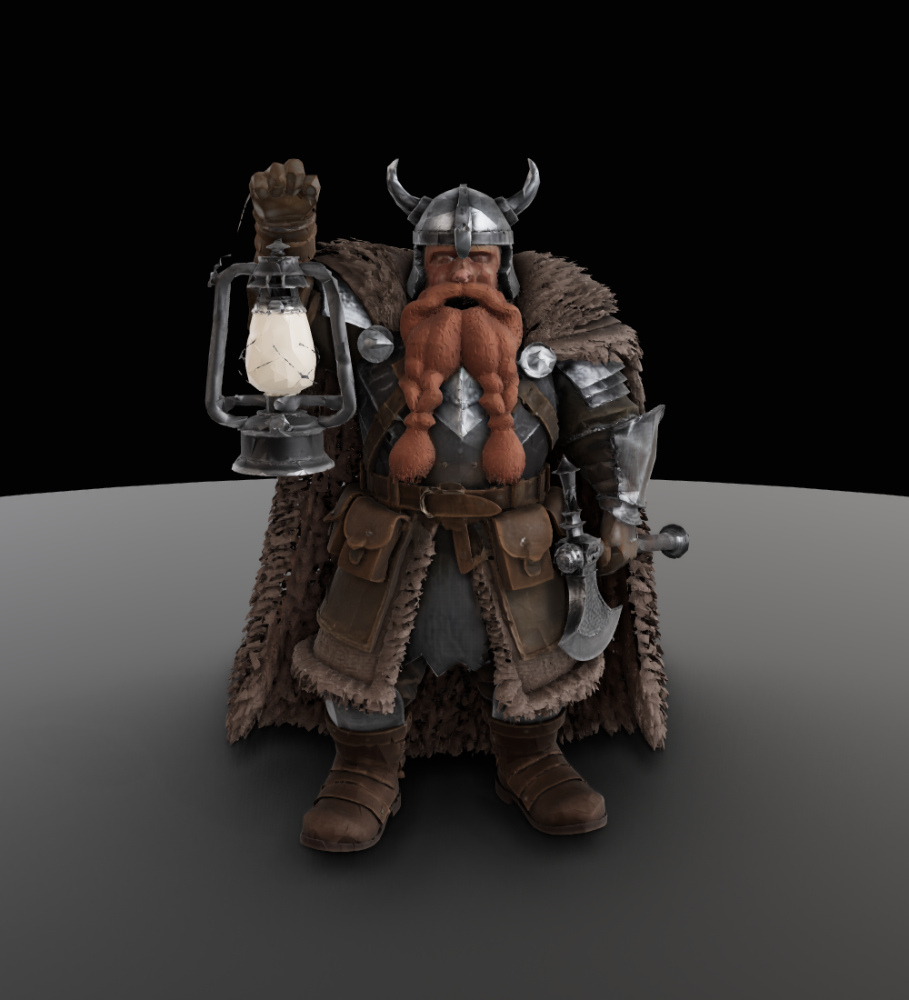
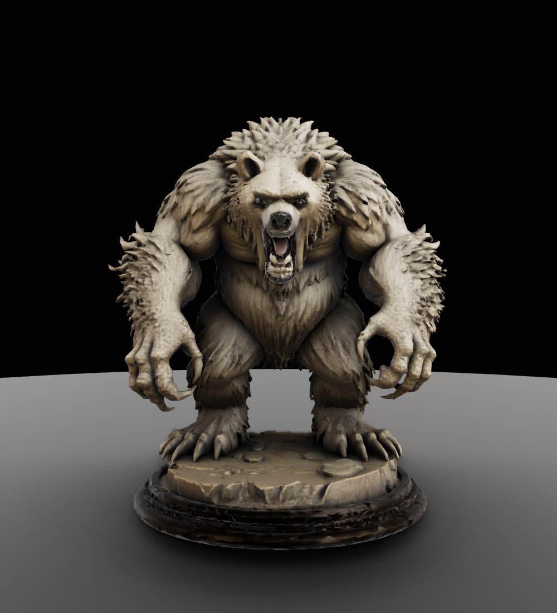
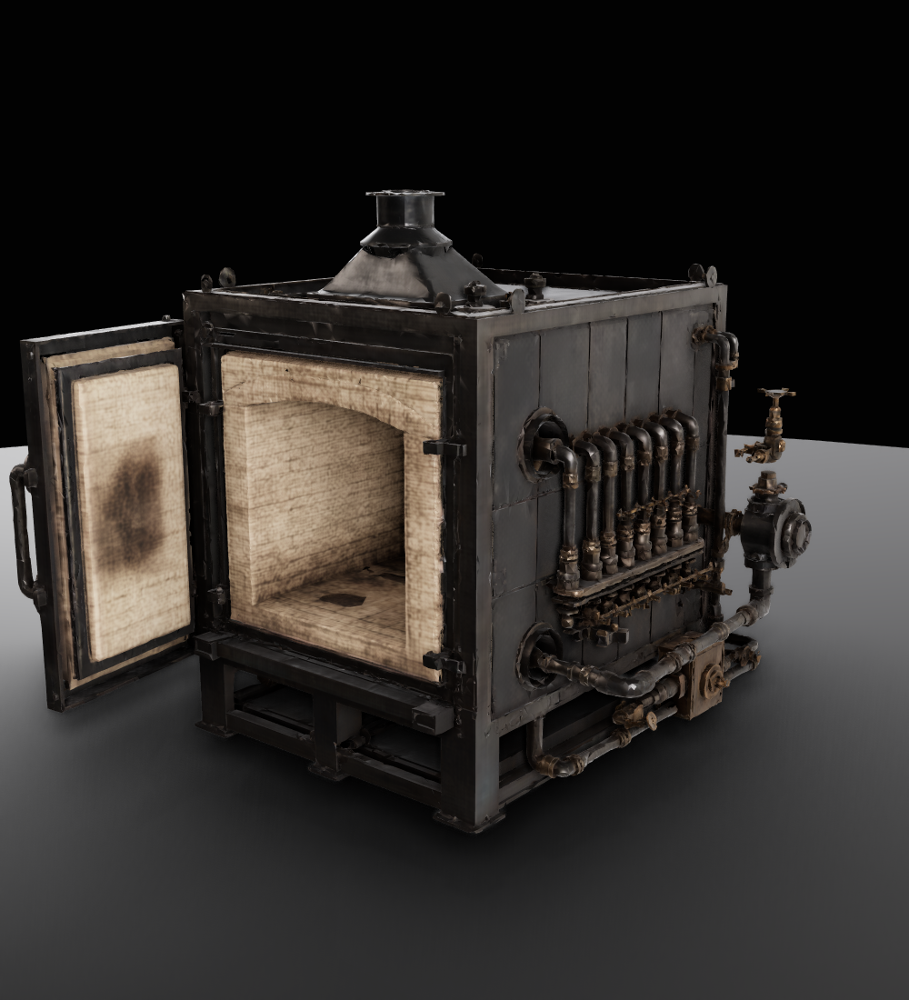

# trellis2mlx

**Turn an image into a textured 3D model on your Mac.**

An [MLX](https://github.com/ml-explore/mlx)-native port of
[TRELLIS.2](https://github.com/microsoft/TRELLIS.2) for Apple Silicon.
It runs image conditioning, shape and material generation locally, then
simplifies the mesh, unwraps it, bakes PBR textures, and exports a GLB.
No NVIDIA GPU or PyTorch is required for the native route.

<table>
<tr>
<td></td>
<td></td>
<td></td>
</tr>
<tr>
<td align="center">Warrior · 768 · 4K maps</td>
<td align="center">Bear · 512 · 1K maps</td>
<td align="center">Kiln · 768 · 4K maps</td>
</tr>
</table>

Actual GLBs rendered in Kaminos, without geometry retouching. The warrior and
bear use the surface-preservation experiment that became the current cleanup
rule; the kiln uses the landed implementation. [Settings and provenance](docs/examples.json).

## Quick start

You need an Apple Silicon Mac, Python 3.11 or newer, and
[uv](https://docs.astral.sh/uv/). A complete textured shoe has been generated on
a **16 GB M2 Pro**; complex high-resolution objects can need considerably more
memory. See the [measured runtimes](#runtime-and-memory) below.

```bash
git clone https://github.com/lyonsno/trellis2mlx.git
cd trellis2mlx
uv venv .venv --python python3.11
source .venv/bin/activate
uv pip install -e .

# Authenticate after obtaining access to the gated DINOv3 weights:
# https://huggingface.co/facebook/dinov3-vitl16-pretrain-lvd1689m
hf auth login

hf download microsoft/TRELLIS.2-4B
hf download microsoft/TRELLIS-image-large
hf download facebook/dinov3-vitl16-pretrain-lvd1689m
```

Start with a single-object image and an eight-step preview:

```bash
PYTHONPATH=. python generate.py \
  --image your_image.png --output preview.glb \
  --seed 42 --steps 8 --no-cascade \
  --target-faces 100000 --texture-size 512 \
  --simplify-first --no-hole-fill --repair-exterior-surface \
  --save-checkpoints checkpoints/preview-01
```

Open `preview.glb` in a GLB viewer or Blender. Keep the checkpoint directory:
it lets you change simplification and texture-map resolution after a successful
run without paying for inference again. Four-step runs are useful for checking
the pipeline, but were too destructive to use as a visual quality baseline.

## More detail, then cheaper iteration

For a detailed 768 cascade with 4K texture maps:

```bash
PYTHONPATH=. python generate.py \
  --image your_image.png --output detailed.glb \
  --seed 42 --resolution 768 --steps 12 \
  --target-faces 500000 --texture-size 4096 \
  --simplify-first --no-hole-fill --repair-exterior-surface \
  --save-checkpoints checkpoints/detail-01
```

Then try a smaller export from the **same saved raw mesh and appearance**:

```bash
PYTHONPATH=. python generate.py \
  --resume checkpoints/detail-01 --output detailed-200k.glb \
  --target-faces 200000 --texture-size 4096 \
  --simplify-first --no-hole-fill --repair-exterior-surface \
  --save-checkpoints checkpoints/detail-200k
```

Use a completed checkpoint set containing raw mesh **and decoded texture
attributes**. A directory with only conditioning or sparse coordinates is not
a supported finishing resume. Keep each run's outputs in a separate directory.

The recipes above deliberately select simplify-first and skip hole filling.
Without overrides, the CLI requests a 1024 cascade, 12 steps, a 200K face
target, 1K maps, and hole filling. Check `python generate.py --help` for all
options; the token budget can reduce the effective cascade resolution.

### Which control changes what?

| Control | What it buys |
|---|---|
| `--no-cascade` | Single-pass 512 generation; useful for previewing an input or seed. |
| `--resolution 768` / `1024` | Higher-resolution cascade geometry and appearance. More inference work and memory. |
| `--steps` | Sampling work per stage. Start at 8 for previews; the detailed recipe uses 12. |
| `--target-faces` | Detail retained during simplification. Increasing it does not rerun or improve inference. |
| `--texture-size` | Baked atlas resolution. 4K maps can improve surface appearance, but cannot restore deleted geometry. |
| `--no-hole-fill` | Avoids adding filling triangles. Omit it to fill small openings, at the cost of a potentially much larger mesh. |
| `--repair-exterior-surface` | Enables the exterior-orientation repair used in the examples. It is separate from surface retention. |
| `--save-checkpoints` / `--resume` | Save inference products and reuse them for finishing experiments. |

A face target is **not a strict final face-count ceiling**. Filling can add
substantial geometry: the saved warrior grows from 962K faces / 103 MB without
filling to 1.66M faces / 148 MB with filling, with only a subtle visible change
in the inspected views. Million-face, UV-expanded exports can also be heavy
in a browser. Start below that budget unless the object's detail warrants it.

## Runtime and memory

These are measured examples, not fixed completion times. Object complexity,
resolution, thermal state and competing workloads matter.

| Machine and case | Scope | Measured time |
|---|---|---:|
| M4 Max, mechanical object, 512 / 8 steps / 100K / 512 maps | Full generation, historical preview matrix | ~3m07s |
| M4 Max, textured shoe, cascade | Full generation, historical reference run | ~8m36s |
| M2 Pro, 16 GB, textured shoe, cascade | Full generation; 6.75 GB peak RSS | 21m05s |
| M4 Max, saved warrior 768 / 1M / 4K, no fill | Finishing only, surface-preservation experiment | 3m49s |
| M4 Max, saved bear 512 / 200K / 1K, no fill | Finishing only, surface-preservation experiment | 37s |

The shoe demonstrates a useful 16 GB route, not a memory ceiling for every
asset. A separate 768 warrior generation reached **63.8 GiB peak process
footprint**. Serialize heavy GPU work; this is not a background workload to
assume will leave the machine unaffected. [Benchmark details and limits](docs/validation.md).

Experimental `--quantize 4` reduces flow-model weight memory by about 6.4×.
It did **not** speed up the measured M2 Pro flow-stage benchmark.
[Quantization measurements and rerun command](docs/validation.md#quantization-experimental).

## What changed in mesh quality

Fine beard and fur surfaces were being lost during cleanup, even when the raw
model output contained them. Repairing non-manifold edges split attached
surfaces into small pieces; a later small-component filter mistook those pieces
for removable debris.

The local cleanup now decides which small components to remove **before**
splitting and preserves that decision through later passes. This recovered
visible surfaces on the warrior and both bear resolutions, without rerunning
inference. Hole filling remains a separate choice: keeping existing detail and
patching openings are different operations.

[Before/after counts, filled/unfilled costs, and the reference-policy distinction](docs/validation.md#surface-preservation).

## Limits and useful next checks

- A coherent output is not guaranteed for every image or seed. Inspect a preview
  before spending on higher resolution.
- Higher face budgets preserve more detail but increase file size, UV work and
  viewer cost. Inspect the exported GLB, not just the requested target.
- Cleanup, inference resolution and texture-map size affect different parts of
  quality. Saved checkpoints let you test finishing changes independently.
- Metal command-buffer failures have occurred on complex runs. Preserve completed
  checkpoints and the failure log; an interrupted directory is not automatically
  resumable.
- `--qem-simplify` remains an experimental alternative. The explicit
  `--reference-cleanup` comparison retains reference split-then-filter behavior
  and cannot be combined with `--no-hole-fill`.

## How it works

Native MLX DINOv3 conditioning → sparse structure → low-resolution shape flow
→ optional high-resolution cascade → mesh extraction and cleanup → texture
flow/decode → UV unwrap, PBR bake and GLB export.

The technical investigation separated numerical differences from damage
introduced after inference. A rough final mesh was not, by itself, evidence of
a broken model port. See the
[cross-runtime causal-forensics case study](docs/cross-runtime-causal-forensics.md),
[historical porting map](docs/architecture-map.md) and [UV unwrap notes](docs/uv-unwrap.md).

## Tests

```bash
uv run --with pytest python -m pytest tests/ -v
```

Test suite covers core modules, onboarding contracts, and witness renderer behavior.
The [validation guide](docs/validation.md#witness-renderer) also includes a
GLB witness renderer that does not rerun inference.

## Credits

- [TRELLIS.2](https://github.com/microsoft/TRELLIS.2) by Microsoft Research — the model.
- [trellis-mac](https://github.com/shivampkumar/trellis-mac) by Shivam Kumar — the earlier PyTorch MPS route that proved Mac viability.
- [trellis2-apple](https://github.com/pedronaugusto/trellis2-apple) by Pedro Naugusto — Metal modules.
- [MLX](https://github.com/ml-explore/mlx) by Apple — the inference framework.

## License

MIT for the porting code. Model weights retain their respective upstream
licenses; see the model repositories linked in the installation instructions.
