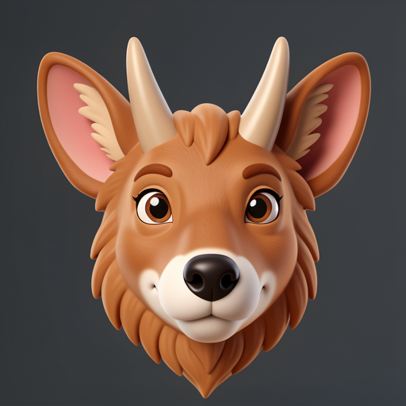
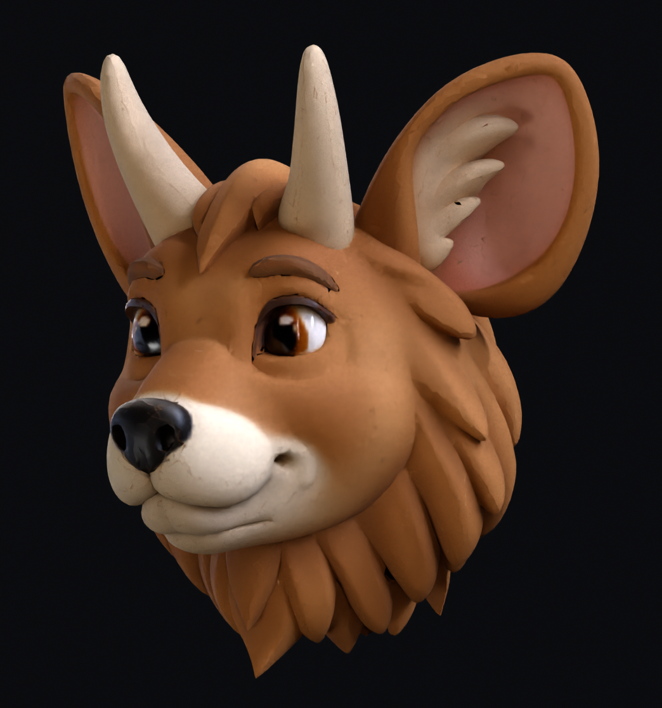

# Validation Evidence

This document records local validation evidence for `trellis2mlx`: commands, hardware, timings, artifact inspection, and witness mechanics.

## M2 Pro Tahoe Run

Full native-DINO shoe run on Apple Silicon:

| Field | Value |
|---|---|
| Machine | M2 Pro, 16 GB unified memory |
| OS | macOS 26.5.1 / Tahoe |
| Input | `assets/shoe_input.png` |
| Command | `PYTHONPATH=. python generate.py --image assets/shoe_input.png --output /tmp/trellis2mlx-tahoe-shoe-full-native.glb` |
| Output GLB | `/tmp/trellis2mlx-tahoe-shoe-full-native.glb` |
| SHA256 | `608f1c3487a02b3545c8d54b4f02fedaa7deb5dd736c0020129e1a86a1033882` |
| Wall time | `1265.04s` |
| Reported total stage time | `1264.4s` |
| Peak RSS | `6.75 GB` |
| Visual inspection | Coherent red shoe form with white upper/swoosh structure and expected single-image reconstruction fragments |
| Witness PNG | [`docs/witnesses/tahoe-shoe-full-native-witness.png`](witnesses/tahoe-shoe-full-native-witness.png) |
| Witness JSON | [`docs/witnesses/tahoe-shoe-full-native-witness.json`](witnesses/tahoe-shoe-full-native-witness.json) |

Recorded stage evidence:

| Stage | Time | Observed output |
|---|---:|---|
| Native DINOv3 | load recorded `412` arrays | features `(1, 1029, 1024)` |
| Sparse structure | `116.9s` | `2,977` sparse voxels |
| LR SLat | `80.0s` | `2,977` tokens |
| Upsample to HR coords | `15.6s` | `761,916` voxels, `12,043` HR tokens |
| HR SLat | `518.0s` | `12,043` tokens |
| Shape decode | `63.2s` | `3,040,506` voxels |
| Mesh extraction and simplify | `6.0s` | `6,016,550` raw faces to `199,999` faces |
| Texture SLat | `290.6s` | `12,043` tokens |
| Texture decode | `60.1s` | 6-channel PBR attributes |
| UV unwrap and texture bake | `97.9s` | unwrap, raster, voxel sample, seam inpaint |

Recorded GLB structure:

| Field | Value |
|---|---|
| Vertices | `264,350` |
| Faces | `199,999` |
| Visual type | `TextureVisuals` |
| Material type | `PBRMaterial` |
| Base color texture | Present |

## M4 Max Reference Run

Reference full pipeline run on Apple Silicon:

| Field | Value |
|---|---|
| Machine | M4 Max, 128 GB unified memory |
| Result | Full textured shoe pipeline |
| Wall time | Approximately `8.6 min` |
| Peak memory | Approximately `3 GB` for SLat flow, approximately `5 GB` during decode |

Recorded stage evidence:

| Stage | Time | Observed output |
|---|---:|---|
| Sparse structure, 12 steps | approximately `34s` | 1.29B parameter DiT on 16^3 grid |
| LR SLat, 1.7K tokens, 12 steps | approximately `14s` | low-resolution sparse latent |
| Upsample to HR coords | approximately `6s` | `463K` voxels |
| HR SLat, 7.2K tokens, 12 steps | approximately `2 min` | 1024 cascade model |
| Shape decode, 1.9M voxels | approximately `73s` | 474M parameter sparse UNet |
| Mesh extraction and simplify | approximately `3s` | `3.7M` raw faces to `200K` faces |
| Texture SLat, 7.2K tokens, 12 steps | approximately `1.3 min` | no CFG, single pass |
| Texture decode, 1.9M voxels | approximately `29s` | 6-channel PBR attributes |
| UV unwrap and texture bake | approximately `2.2 min` | xatlas and trilinear sample |

## Witness Renderer

`scripts/render_glb_witness.py` creates a deterministic PNG witness and JSON report from a GLB without running model inference:

```bash
python scripts/render_glb_witness.py \
  --input /tmp/trellis2mlx-tahoe-shoe-full-native.glb \
  --output /tmp/trellis2mlx-tahoe-shoe-full-native-witness.png \
  --report /tmp/trellis2mlx-tahoe-shoe-full-native-witness.json
```

The renderer writes three orthographic software-projection panels:

| Panel | Projection |
|---|---|
| `front_xz` | X/Z with Y depth sorting |
| `side_yz` | Y/Z with X depth sorting |
| `top_xy` | X/Y with Z depth sorting |

The JSON report records:

| Field | Meaning |
|---|---|
| `status` | `ok` or `error` |
| `route` | Effective witness route, currently `software_projected_mesh_witness` |
| `phase` | `complete` on success, or the failing phase on error |
| `input_glb`, `output_png`, `report_json` | Exact artifact paths used for the run |
| `mesh.vertices`, `mesh.faces`, `mesh.bounds_*`, `mesh.extents` | Structural mesh evidence loaded from the GLB |
| `witness.nonblank`, `witness.pixel_std`, `witness.panels` | Render sanity checks and panel identity |
| `witness.color_route` | Effective color source: texture UV centroid, vertex colors, face colors, material color, or default material fallback |
| `last_trustworthy_evidence` | Error-report evidence available before the failure point |

Failure behavior is part of the contract. Missing inputs, empty meshes, invalid meshes, near-blank renders, and unexpected exceptions produce a JSON report with `status: error` and a phase label; failed runs do not leave a PNG witness behind.

## Test Command

Witness renderer contracts:

```bash
uv run --with pytest python -m pytest tests/test_render_glb_witness.py -v
```

Full local test suite:

```bash
uv run --with pytest python -m pytest tests/ -v
```

## Surface preservation

Saved warrior and bear meshes exposed a specific cleanup bug: edge repair kept
the triangles but disconnected fine sheets; the following small-component
filter then deleted those sheets as if they were floating debris. The local
route now filters genuinely separate small components **before** splitting,
and does not reclassify the resulting fragments on later cleanup passes.
This changes cleanup, not model inference or texture generation.

The same saved inputs reproduce the accepted retained surfaces exactly, down
to ordered triangle coordinates:

| Saved case | Faces retained by the repaired filter | Previously deleted because splitting changed their connectivity |
|---|---:|---:|
| Warrior, 768, 1M simplification target | 961,732 | 207,391 |
| Bear, 768, 1M simplification target | 988,661 | 40,230 |
| Bear, 512, 200K simplification target | 194,018 | 17,685 |

Visual inspection of the finished warrior and 512 bear confirmed recovery of
the beard/fur surfaces. Filled and unfilled versions look very similar, but the
warrior's filled export has 1,662,604 faces and is 147.8 MB, versus 961,732 faces
and 103.1 MB without filling (both with 4K textures). Filling adds triangles; it
does not generate new inferred detail. `--target-faces` is a simplification
target, not a strict final face-count ceiling.

Use `--simplify-first --no-hole-fill` for a lighter detailed mesh. Omit
`--no-hole-fill` when filling small openings is worth the additional geometry.
The explicit `--reference-cleanup` comparison retains its original
split-then-filter semantics and cannot be combined with `--no-hole-fill`.
This surface-preservation policy is deliberately different from reference
CuMesh cleanup, not a claim that the reference already uses it.

## Earlier full-pipeline witness

<table>
<tr>
<td></td>
<td></td>
<td></td>
</tr>
<tr>
<td align="center"><em>Input</em></td>
<td align="center"><em>MLX result, front</em></td>
<td align="center"><em>MLX result, oblique</em></td>
</tr>
</table>

These are Blender/Cycles beauty renders of one MLX-generated GLB from the
[`cc/pixal9-capture-contract-r9-0821`](https://github.com/lyonsno/trellis2mlx/tree/cc/pixal9-capture-contract-r9-0821)
research route at commit
[`e1d987d`](https://github.com/lyonsno/trellis2mlx/commit/e1d987d12c9dc3ed668af5f96d0d525a801bdb6f):
seed 81414, 512 resolution, 8 steps, no cascade, 100K target faces, 512 texture,
and source-ordered cleanup. The exact product completed in 158.4 seconds on the
measured M4 Max route.

Cycles lighting and subsurface-scattering treatment improve presentation in
these witnesses; the geometry and baked textures come from the recorded GLB.

This earlier artifact predates the surface-preservation repair above.
Localized one-sided failures remain around finely articulated crevices, and the
rear hair/horn regions retain texture smearing. The case settings, measurements,
asset hashes, and limitations are preserved in the
[`feature-animation-81412` manifest](research/feature-animation-81412.json).

## What the port uncovered

The numerical investigation remains useful background, but it is no longer an
undifferentiated explanation for every rough final mesh:

1. **The backend authority map matters.** A frozen CUDA witness aligned more
   closely with MLX/CPU than with PyTorch MPS, so copying the existing Mac port's
   discrepancy would have moved MLX away from source behavior.
2. **Local correctness is contextual.** Source-correct tensors could still
   cross a different decoded separatrix when inserted into the wrong residual
   neighborhood; residual-complete joins could recover the source continuation
   exactly.
3. **Inference and finalization are separate causal surfaces.** Semantically
   coherent raw MLX geometry could be damaged or rescued by cleanup order, while
   a six-case replay showed that neither older cleanup order won globally.
   The newer warrior/bear replay isolates a concrete deletion mechanism and
   repairs it without rerunning inference. Resolution, simplification budget,
   filling, and texture resolution must still be distinguished when comparing
   outputs.

[Read the compact cross-runtime causal-forensics case study →](cross-runtime-causal-forensics.md)


## Preview measurements


The cheapest route that exits successfully is not necessarily a useful visual
preview. In a 2026-06-27 M4 Max matrix on an isolated mechanical object, 4-step
no-cascade output finished quickly but produced a shredded false baseline, while
8-step no-cascade preserved the object envelope well enough for candidate triage.
Treat these numbers as a starting heuristic rather than a machine-independent
benchmark; Apple Silicon timing is sensitive to thermal state and other GPU work.

| Mode | Command shape | Measured total | Use |
|---|---|---:|---|
| Plumbing check | `--steps 4 --no-cascade --target-faces 100000 --texture-size 512` | ~62s | Route smoke only; do not judge visual quality from this. |
| Recommended preview | `--steps 8 --no-cascade --target-faces 100000 --texture-size 512` | ~187s | Default search/triage mode; good objectness/cost balance in the measured matrix. |
| Premium preview | `--steps 8 --no-cascade --target-faces 100000 --texture-size 4096` | texture bake +~22-24s measured; wall-clock noisy | Same geometry as preview, better shaded viewport/readback. Use after shape passes. |
| No-cascade higher step | `--steps 10/12 --no-cascade --target-faces 100000 --texture-size 512` | ~296-347s in matrix | More expensive; not clearly better than 8-step for preview on the measured input. |
| Full/final | default cascade, `--target-faces 200000 --texture-size 4096` | ~6-9 min on M4 Max-class runs | Standard final-quality smoke; best objectness and texture read, not a cheap search mode or detail-parity ceiling. |
| Source-detail check | explicit Greenroom `--smoke-profile source-quality` or `--target-faces 500000` | 2026-07-07 checkpoint resume: 129s, xatlas 21.5s on a hard-surface object | Use for reference/detail-retention comparison when 200k postprocess would hide retained raw geometry. |

Texture-size note: in the 8-step no-cascade comparison, `texture-size=512` and
`texture-size=4096` produced identical geometry (120,947 vertices / 107,216
faces). The 4k texture raised GLB size from ~5.9 MB to ~34.8 MB and improved
surface sampling, but did not materially change the yes/no coherence decision in
the deterministic witness. Use 512 during search and reserve 4096 for premium
preview or final presentation.


## Saved-asset finishing and complex-mesh memory

The current gallery uses the saved-mesh surface-preservation experiment for the warrior and bear, and production cleanup for the kiln. [Machine-readable examples](examples.json) bind each image to its GLB hash, settings and finishing source.

| Saved input | Finishing configuration | Finishing time | Final faces / file size |
|---|---|---:|---|
| Warrior768, seed80301, 12-step cascade | 1M target,4K,no fill | 228.79s | 961,732 / 103.1MB |
| Bear512, seed80301,12-step,no cascade | 200K target,1K,no fill | 37.08s | 194,018 / 13.4MB |
| Kiln768, seed42,cascade | 300K target,4K,no fill | 237.56s command wall | 282,835 / 59.8MB |
| Same kiln768 raw mesh and appearance | 500K target,4K,no fill | 72.12s command wall | 485,111 / 69.2MB |

These are finishing-only runs, excluding original inference and queue wait. The kiln arms ran sequentially after a machine reboot; their runtime difference is not a controlled speed comparison. Both used source1201553 and MLX0.32.3. Warrior/bear timings are the experimental controller's elapsed time, not full generation or an end-to-end benchmark of today's main branch.

A separate full768 warrior run at source3a006bc, seed80301,12steps,200K requested target and1K maps took749.4s and reached68,495,887,464bytes (63.8GiB) peak process footprint. It exported553,757faces after filling. That is a different finishing configuration from the gallery, and process footprint is not the same metric as the shoe's peak RSS. The 16GB shoe result must not be generalized to complex fur or million-face output.

## Numerical comparison context


Native MLX model components track a same-weight PyTorch comparator closely in
direct checks, but that historical comparator is not a universal source
authority. CUDA, PyTorch MPS, CPU, and MLX can form different numerical islands;
on a frozen block-7 witness, source CUDA was materially closer to MLX/CPU than to
PyTorch MPS. Treat the current release as a working end-to-end MLX pipeline, not
a promise that every seed/input matches source CUDA or another Mac route
visually.

Historical 12-step same-weight, same-noise PyTorch comparator:

| Step | Correlation | Max diff |
|------|-------------|----------|
| 1 | 0.999999 | 0.009 |
| 3 | 0.999991 | 0.020 |
| 6 | 0.999938 | 0.051 |
| 9 | 0.998852 | 0.434 |
| 12 | 0.968466 | 2.128 |

These measurements remain useful, but the old conclusion that the entire
divergence was monotonic BF16-to-FP16 accumulation was too strong. Controlled
replays now show both smooth accumulation and discrete basin changes. Raw mesh,
cleanup order, simplification, UV processing, and texture bake are tracked as
separate causal surfaces. The repaired warrior/bear deletion described above
is now attributed to cleanup rather than left as an unspecified inference
residual. It does not require matching random seeds across different numerical
backends. See
[`docs/cross-runtime-causal-forensics.md`](cross-runtime-causal-forensics.md)
for the current evidence and claim boundary.


## Quantization (experimental)


`generate.py --quantize 4` uses MLX INT4 quantization on the four flow models
(sparse structure, LR shape SLat, HR shape SLat, and texture SLat). This reduces
flow-model weight memory by about 6.4x, which is useful for packaging and tighter memory
budgets, but there was no speedup on the measured M2 Pro route.

| | FP16 | INT4 |
|---|---|---|
| Weight memory | 5.17 GB | 0.81 GB |
| Forward pass | works | works |

M2 Pro / MLX 0.31.2 stage benchmark, one warmup step plus two timed sampler
steps:

| Stage | FP16 | INT8 | INT4 |
|---|---:|---:|---:|
| Sparse-structure flow, 16³ grid | 9.56s/step | 10.62s/step | 10.70s/step |
| SLat flow, 12,043 tokens | 47.57s/step | 49.94s/step | 52.35s/step |

So the current tradeoff is memory/packaging only: INT8 and INT4 were slower than
FP16 in this benchmark. Further speedups likely need fewer sampler steps,
stage/model reuse, batching, or fused kernels rather than weight-only
quantization.

To rerun the flow-stage benchmark:

```bash
PYTHONPATH=. python scripts/bench_quantization.py \
  --image assets/shoe_input.png \
  --variants fp16,int8,int4 \
  --stages ss-flow,slat-flow
```

The table above was recorded before the reusable harness was committed. The command
reruns the same sparse flow plus synthetic 512-shape-SLat stress benchmark for
future reports; it is not a full four-flow `generate.py --quantize` rerun.

The script writes an incremental JSON report and records the effective repo
head, checkpoint files, host/MLX identity, asset route, variants, stages, and
failure phase if the run stops early.
